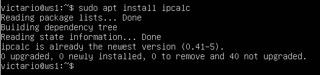
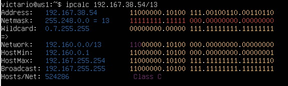
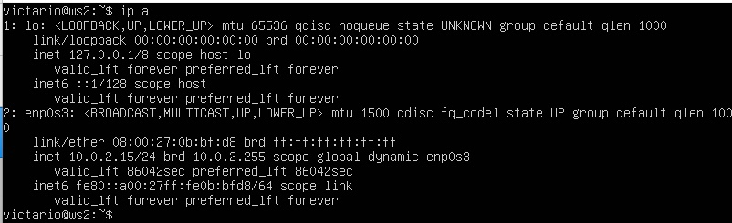
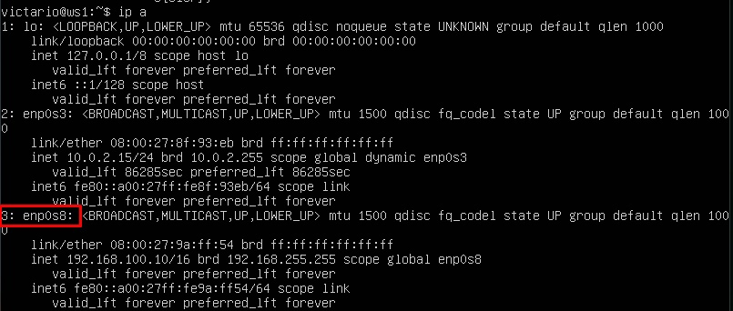
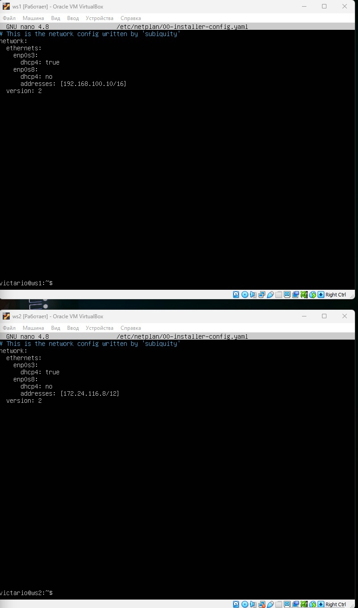
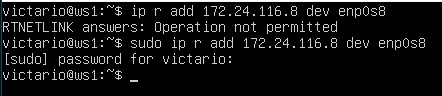
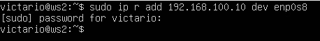
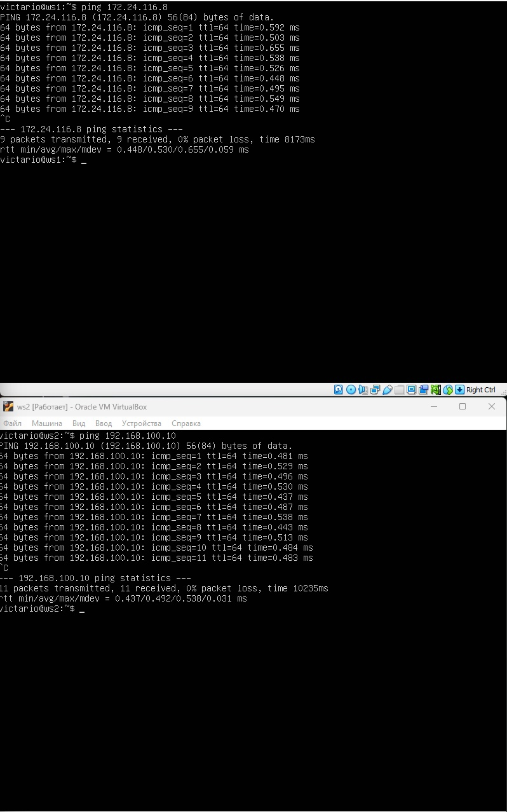
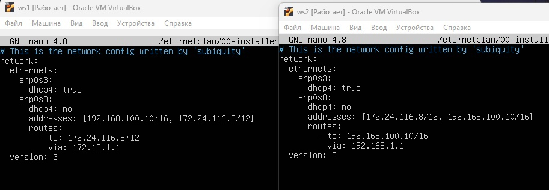
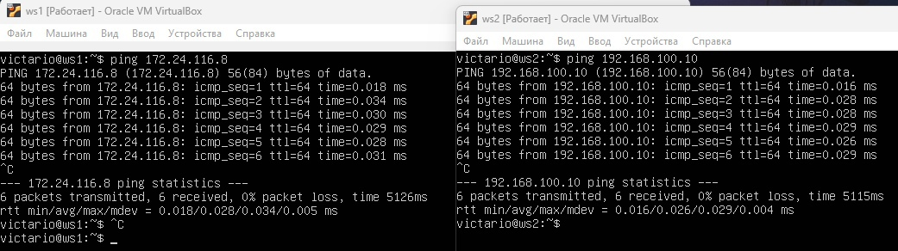

## **Part 1. Инструмент ipcalc**

**1.1. Сети и маски**

Для того, чтобы использовать инструмент, `ipcalc`, снчала скачаем его с помощью команды `sudo apt install ipcalc`.
 

Чтобы получить всю интересующую нас информацию об адресе 192.167.38.54/13, воспользуемся командой `ipcalc 192.167.38.54/13`

1. Определить и записать в отчёт: адрес сети 192.167.38.54/13.

Network: 192.160.0.0

2. Перевод маски 255.255.255.0 в префиксную и двоичную запись, /15 в обычную и двоичную, 11111111.11111111.11111111.11110000 в обычную и префиксную.
* Перевод маски 255.255.255.0 в префиксную и двоичную:
    1. Префиксная запись - /24
    2. Двоичная запись - 11111111.11111111.11111111.00000000
* /15 в обычную и двоичную:
    1. Обычная запись - 255.254.0.0
    2. Двоичная запись - 11111111.11111110.00000000.00000000
* 11111111.11111111.11111111.11110000 в обычную и префиксную.
    1. В обычную - 255.255.255.240
    2. В префиксную - /28
3. Минимальный и максимальный хост в сети 12.167.38.4 при масках: /8, 11111111.11111111.00000000.00000000, 255.255.254.0 и /4
* Маска /8:
    1. HostMin: 12.0.0.1
    2. HostMax: 12.255.255.254
* Маска 11111111.11111111.00000000.00000000:
    1. HostMin: 12.167.0.1
    2. HostMax: 12.167.255.254
* Маска 255.255.254.0:
    1. HostMin: 12.167.38.1
    2. HostMax: 12.167.39.254
* Маска /4:
    1. HostMin: 0.0.0.1
    2. HostMax: 15.255.255.254

**1.2. localhost**
1. Определить и записать в отчёт, можно ли обратиться к приложению, работающему на localhost, со следующими IP: 194.34.23.100, 127.0.0.2, 127.1.0.1, 128.0.0.1:
    * 194.34.23.100 - нет
    * 127.0.0.2 - да
    * 127.1.0.1 - да
    * 128.0.0.1 - нет

**1.3. Диапазоны и сегменты сетей**

1. Какие из перечисленных IP можно использовать в качестве публичного, а какие только в качестве частных: 10.0.0.45, 134.43.0.2, 192.168.4.2, 172.20.250.4, 172.0.2.1, 192.172.0.1, 172.68.0.2, 172.16.255.255, 10.10.10.10, 192.169.168.1:
    * 10.0.0.45 - частный
    * 134.43.0.2 - публичный
    * 192.168.4.2 - частный
    * 172.20.250.4 - частный
    * 172.0.2.1 - публичный
    * 192.172.0.1 - публичный
    * 172.68.0.2 - публичный
    * 172.16.255.255 - частный
    * 10.10.10.10 - частный
    * 192.169.168.1 - публичный

2. Какие из перечисленных IP адресов шлюза возможны у сети 10.10.0.0/18: 10.0.0.1, 10.10.0.2, 10.10.10.10, 10.10.100.1, 10.10.1.255
    * 10.0.0.1- нет
    * 10.10.0.2 - да
    * 10.10.10.10 - да
    * 10.10.100.1 - нет
    * 10.10.1.255 - да

## **Part 2. Статическая маршрутизация между двумя машинами**

1. С помощью команды `ip a` посмотреть существующие сетевые интерфейсы.

При выводе этой команды, можем увидеть 2 сетевых интерфейса lo (localhost), enp0s3.

2. Задать следующие адреса и маски: ws1 - 192.168.100.10, маска /16, ws2 - 172.24.116.8, маска /12.

В меню Virtual Box, в настройках машин, добавляем новый внутренний интерфейс, при вызове команды `ip а`, появится новый интерфейс enp0s8.

Когда мы увидели, что у нас появился новый сетевой интерфейс, поменяем наш конфигурационный файл netplan на обеих машинах, добавив этот интерфейс.

Чтобы применить внесённые изменения, выполним команду sudo netplan apply.

**2.1. Добавление статического маршрута вручную**

1. Добавить статический маршрут от одной машины до другой и обратно при помощи команды вида ip r add

* Добавляем статический маршрут на ws1 до ws2.

* Добавляем статический маршрут на ws2 до ws1.

2. Пропинговать соединение между машинами.
    * Пингуем с ws1 на ws2 и наоборот.

**2.2. Добавление статического маршрута с сохранением**

1. Добавить статический маршрут от одной машины до другой с помощью файла etc/netplan/00-installer-config.yaml

Прописываем в этом файле статические адреса ws1 и ws2, а также шлюзы.

2. Пропинговать соединение между машинами

Обе машины были успешно пропингованы

## **Part 3. Утилита iperf3**

