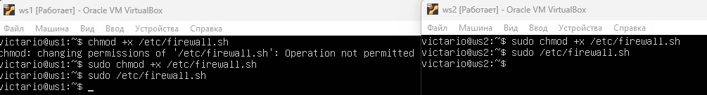
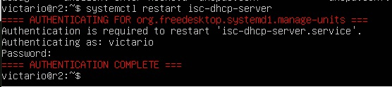
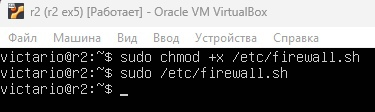
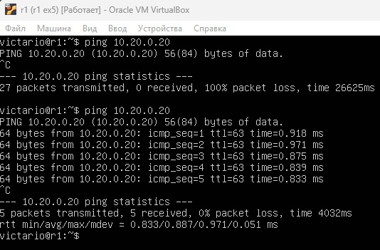
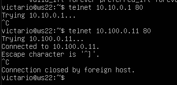

## **Part 1. Инструмент ipcalc**

**1.1. Сети и маски**

Для того, чтобы использовать инструмент, `ipcalc`, сначала скачаем его с помощью команды `sudo apt install ipcalc`.
 

Чтобы получить всю интересующую нас информацию об адресе 192.167.38.54/13, воспользуемся командой `ipcalc 192.167.38.54/13`

1. Определить и записать в отчёт: адрес сети 192.167.38.54/13.

Network: 192.160.0.0

2. Перевод маски 255.255.255.0 в префиксную и двоичную запись, /15 в обычную и двоичную, 11111111.11111111.11111111.11110000 в обычную и префиксную.
* Перевод маски 255.255.255.0 в префиксную и двоичную:
    1. Префиксная запись - /24
    2. Двоичная запись - 11111111.11111111.11111111.00000000
* /15 в обычную и двоичную:
    1. Обычная запись - 255.254.0.0
    2. Двоичная запись - 11111111.11111110.00000000.00000000
* 11111111.11111111.11111111.11110000 в обычную и префиксную.
    1. В обычную - 255.255.255.240
    2. В префиксную - /28
3. Минимальный и максимальный хост в сети 12.167.38.4 при масках: /8, 11111111.11111111.00000000.00000000, 255.255.254.0 и /4
* Маска /8:
    1. HostMin: 12.0.0.1
    2. HostMax: 12.255.255.254
* Маска 11111111.11111111.00000000.00000000:
    1. HostMin: 12.167.0.1
    2. HostMax: 12.167.255.254
* Маска 255.255.254.0:
    1. HostMin: 12.167.38.1
    2. HostMax: 12.167.39.254
* Маска /4:
    1. HostMin: 0.0.0.1
    2. HostMax: 15.255.255.254

**1.2. localhost**
1. Определить и записать в отчёт, можно ли обратиться к приложению, работающему на localhost, со следующими IP: 194.34.23.100, 127.0.0.2, 127.1.0.1, 128.0.0.1:
    * 194.34.23.100 - нет
    * 127.0.0.2 - да
    * 127.1.0.1 - да
    * 128.0.0.1 - нет

**1.3. Диапазоны и сегменты сетей**

1. Какие из перечисленных IP можно использовать в качестве публичного, а какие только в качестве частных: 10.0.0.45, 134.43.0.2, 192.168.4.2, 172.20.250.4, 172.0.2.1, 192.172.0.1, 172.68.0.2, 172.16.255.255, 10.10.10.10, 192.169.168.1:
    * 10.0.0.45 - частный
    * 134.43.0.2 - публичный
    * 192.168.4.2 - частный
    * 172.20.250.4 - частный
    * 172.0.2.1 - публичный
    * 192.172.0.1 - публичный
    * 172.68.0.2 - публичный
    * 172.16.255.255 - частный
    * 10.10.10.10 - частный
    * 192.169.168.1 - публичный

2. Какие из перечисленных IP адресов шлюза возможны у сети 10.10.0.0/18: 10.0.0.1, 10.10.0.2, 10.10.10.10, 10.10.100.1, 10.10.1.255
    * 10.0.0.1- нет
    * 10.10.0.2 - да
    * 10.10.10.10 - да
    * 10.10.100.1 - нет
    * 10.10.1.255 - да

## **Part 2. Статическая маршрутизация между двумя машинами**

1. С помощью команды `ip a` посмотреть существующие сетевые интерфейсы.

При выводе этой команды, можем увидеть 2 сетевых интерфейса lo (localhost), enp0s3.

2. Задать следующие адреса и маски: ws1 - 192.168.100.10, маска /16, ws2 - 172.24.116.8, маска /12.

Поменяем наш конфигурационный файл netplan на обеих машинах.

Чтобы применить внесённые изменения, выполним команду sudo netplan apply.

**2.1. Добавление статического маршрута вручную**

1. Добавить статический маршрут от одной машины до другой и обратно при помощи команды вида ip r add

* Добавляем статический маршрут на ws1 до ws2 и наоборот

1. Пропинговать соединение между машинами.
    * Пингуем с ws1 на ws2 и наоборот.

**2.2. Добавление статического маршрута с сохранением**

1. Добавить статический маршрут от одной машины до другой с помощью файла etc/netplan/00-installer-config.yaml

Прописываем в этом файле статические адреса ws1 и ws2, а также шлюзы.

2. Пропинговать соединение между машинами

Обе машины были успешно пропингованы

## **Part 3. Утилита iperf3**

**3.1. Скорость соединения**

* 8 Mbps - 1 MB/s
* 100 MB/s = 100 * 1000 * 8 = 800000 Kbps
* 1 Gbps = 1000 Mbps

**3.2. Утилита iperf3**

Чтобы измерить скорость соединения между двумя машинами, дадим ws2 роль сервера с помощью команды `iperf3 - s`, а ws1 дадим роль клиента, при этом указав путь до сервера  `iperf3 -c <IP - адрес сервера>`

## **Part 4. Сетевой экран**

**4.1. Утилита iptables**

1. В отчёт поместить скрины с содержанием файла /etc/firewall для каждой машины.

2. Запустить файлы на обеих машинах командами chmod +x /etc/firewall.sh и /etc/firewall.sh

После того, как мы запустили наш фаервол, попробуем пропинговать обе машины.

Пингуем с ws1 на ws2:

Пингуем с ws2 на ws1:

Как мы можем заметить, у нас не получается пропинговать ws1, т. к. первое встреченное правило в фаерволе будет выполнено. Правило, которое встертилось после, будет проигнорировано.

**4.2. Утилита nmap**

Мы убедились в том, что машина ws1  не пингуется, т.к. первое правило в фаерволе было запрещающим. Используем команду `nmap 192.168.100.10`, чтобы проверить, что хост машины запущен.

## **Part 5. Статическая маршрутизация сети**

**5.1. Настройка адресов машин**

* В отчёт поместить скрины с содержанием файла etc/netplan/00-installer-config.yaml для каждой машины.

Настройка файла `etc/netplan/00-installer-config.yaml` для ws11, ws21, ws22:

Настройка файла `etc/netplan/00-installer-config.yaml` для r1, r2:

* Перезапустить сервис сети. Если ошибок нет, то командой ip -4 a проверить, что адрес машины задан верно. 

* Также пропинговать ws22 с ws21.

* Аналогично пропинговать r1 с ws11.

**5.2. Включение переадресации IP-адресов.**

* Для включения переадресации IP, выполните команду на роутерах: sysctl -w net.ipv4.ip_forward=1

* Откройте файл /etc/sysctl.conf и добавьте в него следующую строку: net.ipv4.ip_forward = 1

**5.3. Установка маршрута по-умолчанию**

* Настроить маршрут по-умолчанию (шлюз) для рабочих станций. Для этого добавить default перед IP роутера в файле конфигураций:

* Вызвать ip r и показать, что добавился маршрут в таблицу маршрутизации:

* Пропинговать с ws11 роутер r2 и показать на r2, что пинг доходит. Для этого использовать команду: tcpdump -tn -i eth1

**5.4. Добавление статических маршрутов**

* Добавить в роутеры r1 и r2 статические маршруты в файле конфигураций. 
  

* Вызвать ip r и показать таблицы с маршрутами на обоих роутерах.

* Запустить команды на ws11: ip r list 10.10.0.0/[маска сети] и ip r list 0.0.0.0/0

Если выбран маршрут, отличный от 0.0.0.0/0 для адреса 10.10.0.0/маска сети, значит в таблице маршрутизации имеется запись с более точным маршрутом, который указывает конкретный путь для доставки пакета на узел сети назначения.

**5.5. Построение списка маршрутизаторов**

* При помощи утилиты traceroute построить список маршрутизаторов на пути от ws11 до ws21

Определяем маршрут пакета от ws11 до ws21 с помощью команды `traceroute`:

Перехватываем и анализируем трафик, проходящий через r1 с помощью команды `tcpdump`:

Когда `traceroute` отправляет пакет, он устанавливает значение TTL (Time to Live) в хедере IP пакета, которое уменьшается на единицу каждый раз, когда проходит через маршрутизатор. Когда значение TTL достигает нуля, маршрутизатор отправляет обратно ICMP пакет с сообщением "Time Exceeded" и IP-адресом маршрутизатора. 
`Traceroute` повторяет этот процесс, увеличивая значение TTL и затем записывая IP-адреса всех прошедших маршрутизаторов, пока пакет не достигнет своего назначения. Эта последовательность IP-адресов составляет маршрут следования пакета, который `traceroute` выводит на экран в виде таблицы. 

**5.6. Использование протокола ICMP при маршрутизации**

* Запустить на r1 перехват сетевого трафика, проходящего через eth0 с помощью команды:
tcpdump -n -i eth0 icmp и пропинговать с ws11 несуществующий IP с помощью команды: `ping -c 1 10.30.0.111`

## **Part 6. Динамическая настройка IP с помощью DHCP**

* Для r2 настроить в файле /etc/dhcp/dhcpd.conf конфигурацию службы DHCP и в файле resolv.conf прописать nameserver 8.8.8.8:

* Перезагрузить службу DHCP командой `systemctl restart isc-dhcp-server`:

* Машину ws21 перезагрузить при помощи reboot и через ip a показать, что она получила адрес:

* Пропинговать ws22 с ws21:

* Указать MAC адрес у ws11:

* Для r1 настроить в файле /etc/dhcp/dhcpd.conf конфигурацию службы DHCP и в файле resolv.conf прописать nameserver 8.8.8.8:

* Перезагружаем службу DHCP командой `systemctl restart isc-dhcp-server`, проверяем состояние:

* Машину ws11 перезагрузить при помощи reboot и через ip a показать, что она получила адрес:

* Пропинговать ws22 с ws11:

* Запросить с ws21 обновление ip адреса

Опция `option routers 10.20.0.1` указывает на IP-адрес шлюза по умолчанию в сети. Когда клиент подключается к сети, он получает этот адрес и использует его для связи с другими узлами вне локальной сети через шлюз.

Опция `option domain-name-servers 10.20.0.1` указывает на IP-адрес(а) DNS-сервера(ов), которые будут использоваться клиентом для разрешения имен хостов в IP-адреса.

## **Part 7. NAT**

* В файле /etc/apache2/ports.conf на ws22 и r1 изменить строку Listen 80 на Listen 0.0.0.0:80:

* Запустить веб-сервер Apache командой service apache2 start на ws22 и r1:

* Добавляем в фаервол r2 данные парвила:
  1. Удаление правил в таблице `filter - iptables -F`
  2. Удаление правил в таблице "NAT" - `iptables -F -t nat`
  3. Отбрасывать все маршрутизируемые пакеты - `iptables --policy FORWARD DROP`

* Запускаем фаервол:

* Проверяем соединение между ws22 и r1 командой `ping`:

* Добавляем ещё 1 правило в фаервол в r2: разрешить маршрутизацию всех пакетов протокола ICMP

* Запускаем фаервол:

* Проверяем соединение между ws22 и r1 командой `ping`:

* Добавляем ещё 2 правила в фаервол в r2:

    1. Включить SNAT, а именно маскирование всех локальных ip из локальной сети, находящейся за r2.
    2. Включить DNAT на 8080 порт машины r2 и добавить к веб-серверу Apache, запущенному на ws22, доступ извне сети.

* Запускаем фаервол:

* Проверить соединение по TCP для SNAT, для этого с ws22 подключиться к серверу Apache на r1 командой: `telnet 10.100.0.11 80`

* Проверить соединение по TCP для DNAT, для этого с r1 подключиться к серверу Apache на ws22 командой telnet (обращаться по адресу r2 и порту 8080):

